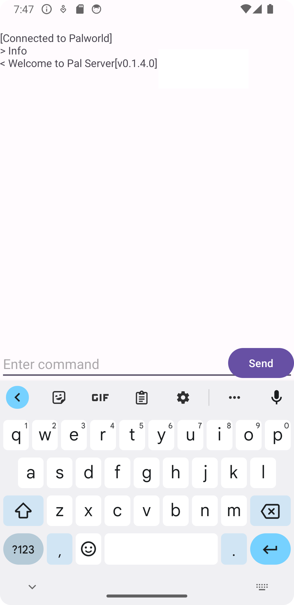
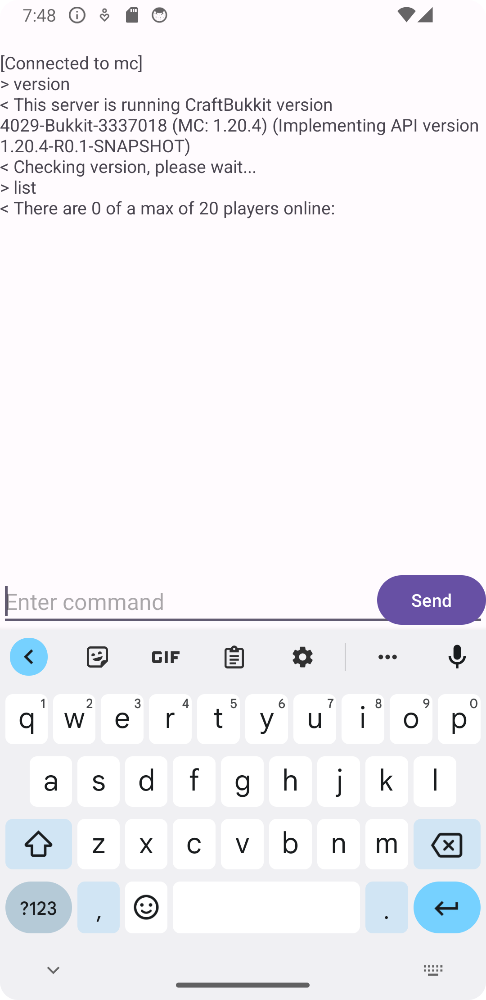

# OpenRCON

This is a powerful RCON client for android. Provides a remote console for game servers using the RCON protocol.

The client should be compatible with the following games:

- Minecraft
- Palworld
- ARK: Survival Evolved
- Factorio
- Project Zomboid
- V Rising
- Conan Exiles
- Team Fortress 2

The client is also compatible with any game server correctly implementing the Source-RCON protocol.

